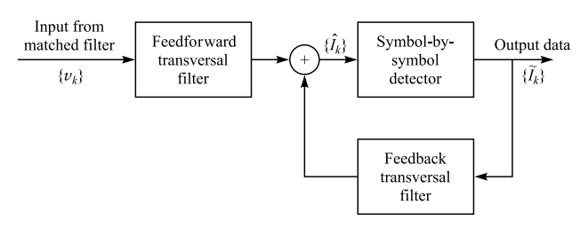

# Decision-Feedback Equalization (DFE)

Hash name:

keywords: nonlinear equalizer, decision feedback, feedforward filter, feedback filter

## Review of Equalization ISI Channel

- Optimum detector: maximum likelihood sequence estimation (MLSE)
- Suboptimum detector: 
  - linear equalizer： transversal filter
  - nonlinear equalizer: DFE

## General Structure of DFE

Fig. 1: Structure of decision-feedback equalization

Assume an **equivalent discrete-time whitened noise channel** having the system function $A(z)$ with a finite duration, the qualizer output is

$$\hat{I}_k=\sum_{j=-K_1}^{0}c_jy_{k-j}+\sum_{j=1}^{K_2}c_j\tilde{I}_{k-j},$$

where $c_j$ is the coefficient, $\hat{I}_k$ is the estimate of $k$th information symbol, and $\tilde{I}_k$ is the previouly detected symbols. There are totally $K_1+K_2+1$ equalizer coefficient, where $K_1+1$ taps for feedforward module and $K_2$ for feedback module. $y_k$ is the received symbol through the equivalent discrete-time whitened noise channel as

$$y_k=\sum_{n=0}^{L}a_nI_{k-n}+\eta_k.$$

The target here is to minimize the MSE of estimated symbol and the true symbol

$$J(K_1,K_2)=\mathbb{E}\left[|I_k-\hat{I}_k|^2\right].$$

Similar to the analysis of [error vector](6ad0611ed5bc0a29f0cafafe0bfc24ee), we can rewrite the error components with respect to orthogonality. For $l=-K_1,\cdots,-1,0$,

$$\begin{aligned}
  \mathbb{E}\left[\hat{I}_ky_{k-l}^*\right]&=\mathbb{E}\left[\left(I_k-\left(\sum_{j=-K_1}^{0}c_jy_{k-j}+\sum_{j=1}^{K_2}c_j\tilde{I}_{k-j}\right)\right)y_{k-l}^*\right]\\
  &=\mathbb{E}[I_ky_{k-l}^*]-\mathbb{E}\left[\sum_{j=-K_1}^{0}c_jy_{k-j}y_{k-l}^*\right]-\mathbb{E}\left[\sum_{j=1}^{K_2}c_j\tilde{I}_{k-j}y_{k-l}^*\right]\\
  &=a_{-j}^*E[I_kI_k^*]-\sum_{j=-K_1}^{0}c_j\sum_{m=0}^{-l}a_m^*a_{m+l-j}^*\mathbb{E}[I_{k-l-m}I_{k-l-m}^*]-\sum_{j=1}^{K_2}c_ja_{k-j}^*\mathbb{E}[\hat{I}_{k-j}I_{k-j}^*]
\end{aligned}$$

For the feedforward filter, we have

$$\sum_{j=-K_1}^{0}\psi_{lj}c_j=f_{-l}^*,\quad l=-K_1,\cdots,-1,0,$$

where

$$\psi_{lj}=\sum_{n=0}^{-l}a_m^*a_{m+l-j}+\sigma^2\delta_{lj},\quad l,j=-K_1,\cdots,-1,0.$$

For feedback filter, we have 

$$c_k=-\sum_{j=-K_1}^{0}c_jf_{k-j}$$

