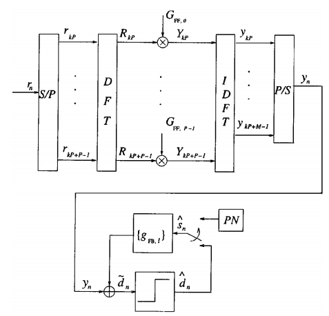
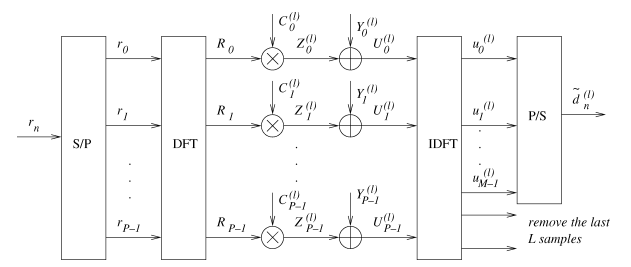
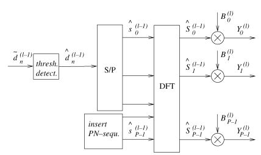

> Overview Equalization

Equalizer, a filter usually implemented in the receiver, aims to eliminate the deep fade due to the multi-path effect (inter symbol interference, ISI) by reversing the channel gain.

# 1. Single-Carrier (SC) Transmission

## 1.1. The RAKE Receiver

The Rake recevier is a structure of receiver instead of an algorithm used for the multi-path envrionment. It is used in **3G cellcular system (CDMA)** with **direct spread spectrum sequence (DSSS)**. Multipath components having different delays can degrade (or of course increase) the total received gain (deep fade). The Rake receiver is designed to capture **most of the energy** carried by a very large number of different multipath signals. An **ideal Rake receiver** refers to that combines all of the resolvable multipath component constructively. However, in practice, the number of multipath components that can be utilized in a typical Rake combiner is limited by power consumption issues, design complexity, and the channel estimation. Thus, it is expected that a subset of $L_r$ resolved multipath components, say, $L_b$, can achieve best performance, where the signals received by $L_b$ fingers are combined by the ***maximal-ratio combining (MRC)*** scheme (Cassioli, 2002).

The design issue of the Fake receiver

- The number of Rake finger (correlator). Each finger can detect/extract the signal from one of the multipath components provided by the channel.

### 1.1.1. The Rake Receiver is not used with OFDM

The Rake receiver treats the multi-path effect in the **time domain**. It is widely used in the **single-carrier system**. Note that it is **not used** in multi-carrier system, like OFDM. OFDM treats the multi-path effect in the **frequency domain**. If some of the multipath components are neglected, or timly rearrange, the performance of OFDM degrades. Therefore, the Rake receiver is in the 3G standard, which is based on coding multiplex, while it is not in the 3G standard any more, where OFDM is the multiplexing scheme. 

### 1.1.2. Type of Rake Receiver

#### 1.1.2.1. All-Rake (ARake)

ARake is the ideal Rake receiver that combines all of the $L_r$ resolvable multipath components.

#### 1.1.2.2. Selective-Rake (SRake)

SRake selects the $L_b$ best paths out of $L_r$ resolvable paths and them combines them using MRC.

#### 1.1.2.3. Parital-Rake (PRake)

PRake combines the first $L_p$ arriving paths out of the $L_r$ resolvable multipath components. The best advantage of PRake is that the gain the path doesn't need to be estimated.

> These three types of Rake receiver, i.e. ARake, Srake and PRake, were compared in (Cassioli, 2002). At 1 meter distance, ARake outperforms SRake by 9 dB, while SRake outperforms PRake by 5 dB when BER equals $10^{-4}$.

## 1.2. Time Domain (TD) Equalization (TDE)

### 1.2.1. RAKE-Like Equalizer

## 1.3. Frequency Domain (FD) Equalization (FDE)

### 1.3.1. Zero Forcing (ZF)

### 1.3.2. Minimum Mean Square Error (MMSE)

> However, ZF and MMSE suffers from **significant noise enhancement** for transmission over deep frequency-selective fading channels, which may result in considerable performance degradation. This can be overcomed by a  **decision feedback equalizer (DFE)**.

## 1.4. Decision Feedback Equalization (DFE)

DFE has a much greater complexity both in design and in signal processing compared to linear equalizer. Zervos and Kalet (Zervos & Kalet, 1989) proved that, at high SNRs, an **SC system** with a **TD unconstrained length DFE** and OFDM have the **same** capacity.

### 1.4.1. Freqeuncy-Domain Feedforward + Time-Domain Feedback

*Figure: FBE with frequency-domain feedforward filter and time-domain feedback filter (Benvenuto, 2002).*

### 1.4.2. Iterative Block DFE (IBDFE)

*Figure: Frequency-domain feedforward filter of IBDFT (Benvenuto, 2005).*

*Figure: Frequency-domain feedback filter of IBDFT (Benvenuto, 2005).*

Benvenuto proposed a FD DFE for SC systems in (Benvenuto, 2002) by making use of a **data block transmission** strucutre like CP. This DFE is a nonadaptive DFE, where the feedforward part is implemented in the frequency domain, while the feedback filter in the time domain. No matrix inversion is needed.

# 2. References

- Benvenuto, N. & Tomasin, S. (2002). On the comparison between OFDM and single carrier modulation with a DFE using a frequency-domain feedforward filter. *IEEE Transactions on Communications*, vol. 50, no. 6.
- Benvenuto, N. & Tomasin, S. (2005). Iterative design and detection of a DFE in the frequency domain. *IEEE Transactions on Communications*, vol. 53, no. 11.
- Cassioli, D. & Win, M. Z. & Vatalaro, F. & Molisch, A. F. (2002). Performance of low-complexity rake reception in a realistic UWB channel. *ICC*.
- Zervos, N. A. & Kalet I. (1989). Optimized decision feedback equalization versus optimized orthogonal frequency division multiplexing for high-speed data transmission over the local cable network. *Proc. ICC'89*, Boston, MA, pp. 1080-1085.