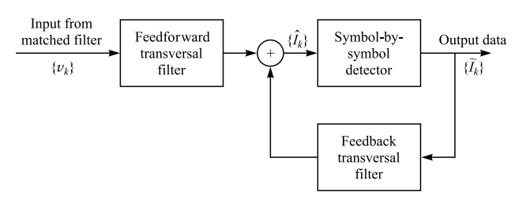

# Decision-Feedback Equalization (DFE)

Hash name:

keywords: nonlinear equalizer, decision feedback, feedforward filter, feedback filter

## Review of Equalization ISI Channel

- Optimum detector: maximum likelihood sequence estimation (MLSE)
- Suboptimum detector: 
  - linear equalizer： transversal filter
  - nonlinear equalizer: DFE

## General Structure of DFE

Fig. 1: Structure of decision-feedback equalization

Assume an equivalent discrete-time whitened noise channel having the system function $A(z)$ with a finite duration, the qualizer output is

$$\hat{I}_k=\sum_{j=-K_1}^{0}c_jv_{k-j}+\sum_{j=1}^{K_2}c_j\tilde{I}_{k-j},$$

where $c_j$ is the coefficient, $\hat{I}_k$ is the estimate of $k$th information symbol, and $\tilde{I}_k$ is the previouly detected symbols. There are totally $K_1+K_2+1$ equalizer coefficient, where $K_1+1$ taps for feedforward module and $K_2$ for feedback module.

