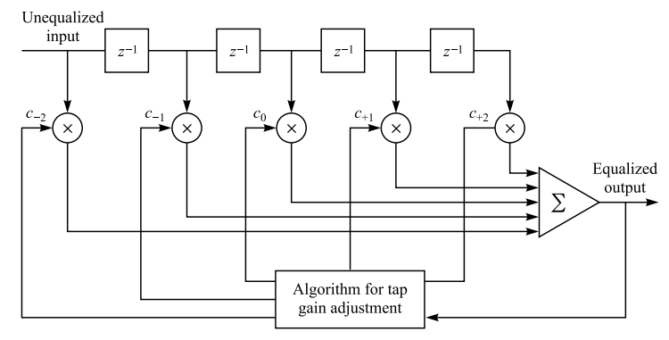

# Linear Equalization for Intersymbol Interference Channel

## Keywords

linear equalization, intersymbol interference， transversal filter

## Optimum Detection For ISI

The optimal method to detect signal in ISI channel is maximum likelihood sequence Estimation (MLSE). However, it has a large computational complexity growing exponentially with the length of the channel time dispersion.

## The Suboptimum Channel Equalization - Linear Methods

One approach is a linear transversal filter, whose computational complexity is a linear function of the channel dispersion length $L$.

The input unequalized received sequence (or output of the receiver filter) $\{y_k\}$, the output sequence $\{\hat{I}_k\}$ of the linear transversal filter is

$$\hat{I}_k=\sum_{j=-K}^{K}c_jy_{k-j},$$

where $\{c_j\}$ are the $2K+1$ complex-valued tap weight coefficients of the filter. Many researches have been done to optimize $c_k$. The **most meaningful** measure of performance for a digital communication system is the **average probability of error**. There are two criteria have been widely used in optimizing the equalizer coefficients.

## Criterion 1: Peak Distortion

Remind that the narrow-band transmission model [##](6ad0611ed5bc0a29f0cafafe0bfc24ee) is

$$y(t)=\sum_{n=0}^{\infty}I_nx(t-nT)+n(t),$$

where $x(t)$ is the effective pulse, $I_n$ is the complex symbol at time $t=nT$. The discrete form sampled at $t=kT$ is

$$y_k=I_k+\sum_{n=0,n\neq k}^{\infty}I_nx_{k-n}+n_k，$$

with normalized $x_0=1$.

### Infinite-Length Filter

Similarly, assume firstly the transversal filter is **infinite**, if the input cascaded discrete-time linear filter model (effective pulse) is $\{x_k\}$, the output weight for equalization is

$$q_n=\sum_{j=-\infty}^{\infty}c_jx_{n-j}.$$

The equalized signal at the $k$th sampling instant is

$$\begin{aligned}
    \hat{I}_k&=\sum_{j=-\infty}^{\infty}c_jy_{k-j}\\
    &=\sum_{j=-\infty}^{\infty}c_j\left(x_{-j}I_{k}+\sum_{n=-\infty,n\neq k}^{\infty}I_{n}x_{k-j-n}+n_{k-j}\right)\\
    &=\sum_{j=-\infty}^{\infty}c_jx_{-j}I_{k}+\sum_{n=-\infty,n\neq k}^{\infty}\sum_{j=-\infty}^{\infty}c_jx_{k-j-n}I_{n}+\sum_{j=-\infty}^{\infty}c_jn_{k-j}\\
    &=q_0I_k+\sum_{n=-\infty,n\neq k}^{\infty}I_{n}q_{k-n}+\sum_{j=-\infty}^{\infty}c_jn_{k-j}
\end{aligned}$$

We can normalize the scaling factor $q_0=1$. The second term is the **intersymbol interference**. The peak value of this interference is when the complex $I_nq_{k-n}$ has same phase. Therefore, the *peak distortion* is defined as

$$\mathcal{D}(\mathbf{c})=\sum_{n=-\infty,n\neq0}^{\infty}|q_n|=\sum_{n=-\infty,n\neq0}^{\infty}\left|\sum_{j=-\infty}^{\infty}c_jx_{n-j}\right|.$$

From the above equation, we know that if $q_n=0$ for all $n$ except $n=0$, the intersymbol interference can be completely eliminated, i.e.

$$q_n=\sum_{j=-\infty}^{\infty}c_jx_{n-j}=\begin{cases}
    1,&n=0\\0,&n\neq0
\end{cases}.$$

Considering the $z$ transform, we have

$$Q(z)=C(z)X(z)=1.$$

One simple equalizer, called **zero-forcing (ZF) filter** is

$$C(z)=\frac{1}{X(z)}$$

## Criterion 2: Mean Square Error (MSE)

