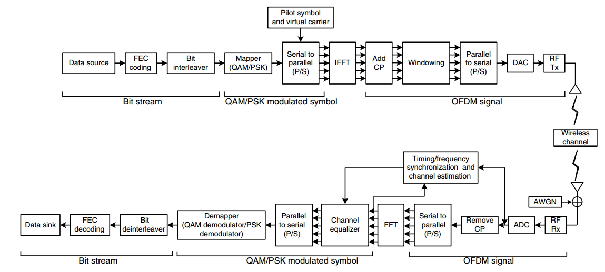
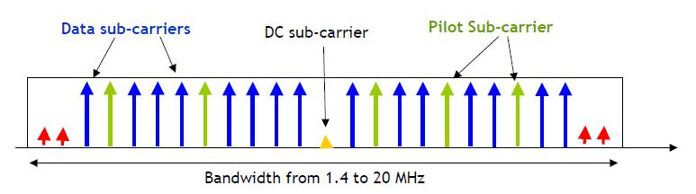
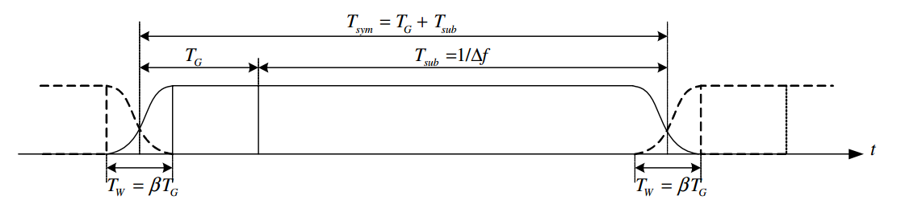
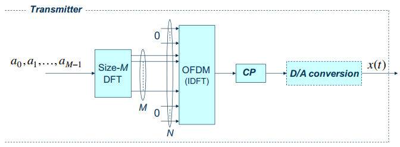
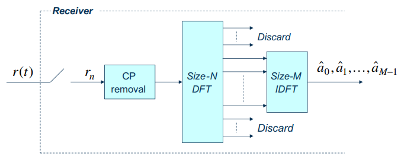

> Survey of Orthogonal Frequency Devision Multiplex (OFDM)

# 1. Notation

Notation | Meaning
---------|---------
$T_s$ | duration of a symbol
$T_{OFDM}$ | duration of a OFDM symbol
$T_{sub}$ | duration of a OFDM symbol without guard interval
$T_{g}$ | duration of guard interval (e.g. CP)
$N_{sub}$ | number of subcarriers without guard interval
$n$ | the sample time index
$k$ | the subcarrier index

# 2. Overview of Single-Carrier Transmission

The transmitted symbols are **pulse-shaped** by a filter at the transmitter. Then receiveing them through a **band-limited** channel with the **receiver filter**, **eqalized** and **detector**. The equalizer is designed to compensate the effect of channel. Since the channel bandwidth is finite, the pulse-shaping filter cannot be time-limited, which may introduce inter-symbol interference (ISI).

Assume that the channel effect is completely compensated by the equalizer. The **ISI-free** transmission is guaranteed by the **Nyquist criterion**. The Nyquist filter is an ideal low pass filter (LPF), which is a sinc function in time-domain. But the ideal Nyquist filter is not physically realizable. Instead, we can use the **raised-cosine filter** at the transmitter, whose bandwidth is wider than that of Nyquist filter. If the channel is ideal, the transmit filter and receiver filter can be **square-root raised cosine filters**, which are a raised cosine filter when they are combined.

With the symbol rate becoming larger, the signal bandwidth becomes larger. If the signal bandwidth becomes larger than the coherence bandwidth, the link suffers the **multi-path effect**, another type of ISI. In general, adaptive equaliers implemented by finite impulse response (FIR) filters with cap coefficients are employed to deal with the ISI incurred by multi-paths.

The equalizer in single-carrier transmission is usually done in the time domain. The **optimum** equalizer for the multi-path fading channel is **maximum-likelihood sequence detector (MLSD)**. One type of **suboptimum** equalizers is the **linear** transversal filter (such as **zero-forcing**, **least-square**, **minimum mean square error**). The **decision-feedback equalizer** exploits the **nonlinearity** by adding a feedback module to improve performance of the linear equalization.

## 2.1. Single-Carrier (SC) Transmission vs. Multi-Carrier (MC) Transmission

OFDM procession requires on the order of $\log_2M$ multiplications per data symbol, counting both transmitter and receiver operation, where $M$ is the length of the block of the signal, and is proportional to the maximum expected channel response length (at least 4-10 times longer than the maximum impulse response span to minimize the fraction of overhead). For single-carrier transmission under sever multi-path effect, the complexity (the number of taps of the time domain linear filter) is considerably high. Therefore, **OFDM** appears to offer a **better** performance/complexity trade-off than conventional SC modulation with time domain equalization for **large** (> about 20 taps) multipath spread (McDonnel, 1996), (Falconer, 2002).

### 2.1.1. Equalization of SC Transmission

Sari et al. (Sari, 1994 & Sari, 1995) pointed out that when combined with **FFT processing** and the use of a **cyclic prefix**, a single-carrier system with frequency-domain equalization (FDE) (SC-FDE) has essentially the **same performance** and **low complexity** as an OFDM system. Zervos and Kalet (Zervos, 1989) have also proven that for an unconstrained length ZF DFE and high SNRs, OFDM and SC FD-DFE have the same capacity. More detail for equalization for SC systems can be refered to the equalization documentation.

In fact, SC and OFDM modems can easily be configured to **coexist**, and **significant advantages** may be obtained through such coexistence.

### 2.1.2. OFDM vs. Single-Carrier

It has already been shown that when channel loading (adaptive modulation on each subcarrier of OFDM) is performed, the OFDM exhibits a sharp increase of performance over FD-LE (Czylwik, 1007).

# 3. OFDM History and Introduction

In the mid 60s, the concept of using parallel data transmission and frequency division multiplexing (FDM) was published, where overlapping subchannels are used to **avoid the high speed equalization in the time domain**. The inital applications were in military communications. Later, it was applied in telecommunication field, where the discrete multi-tone (DMT) and the multicarrier modulation (MCM) are standarized.

## 3.1. Disadvantage of OFDM

- High peak-to-average power ratio;
- Sensitive to carrier frequency offset and phase noise.

**<to do>**

## 3.2. From Time Domain To Frequency Domain: Linear And Circular Convolution

The multi-carrier system considers usually an equivalent frequency-domain transmission model. Since the signal in the frequency domain equalization is formed on blocks by DFT, the equivalence between the **time-domain convolution** and the **frequency-domain multiplication** holds **only if** the **transmitted signal** forces the **linear convolution** with the channel impulse response to be **circular** (Benvenuto, 2002):

$$s_n=s_{n+P},\quad n=0,1,\cdots,L-1.$$

This is a $P$-size DFT.

```Matlab
% Example: Linear and Circular Convolution
s = [1,2,3]; % assume to be the signal
h = [1,1,1]; % assume to be the channel

% DFT and IDFT not invertible with linear convolution <=> alising
rLin = conv(s,h); % linear convolution [1,3,6,5,3]
rDft = ifft(fft(s).*fft(h)); % [6,6,6]

% DFT <=> circular convolution
rCir4  = cconv(s,h,4); % circular convolution [4,3,6,5]
rDftC4 = ifft(fft(s,4).*fft(h,4)); % [4,3,6,5],
rCir5  = cconv(s,h,5); % circular convolution [1,3,6,5,3]
rDftC5 = ifft(fft(s,5).*fft(h,5)); % [1,3,6,5,3]
rCir6  = cconv(s,h,6); % circular convolution [1,3,6,5,3,0]
yDftC6 = ifft(fft(s,6).*fft(h,6)); % [1,3,6,5,3,0]

% from linear convolution to circular convolution
% method 1: add cyclic prefix
%  equivlently add zero to avoid aliasing
s2 = [2,3,1,2,3]; % cyclic prefix with length 2
h2 = [1,1,1]; % assume to be the channel
r2 = conv(s2,h2); % [2,5,6,6,6,5,3]
r2 = r2(1:5); % linear convolution: output same length as input
r2Final = r2(3:end); % discard cyclic prefix [6,6,6] = ifft(fft(s).*fft(h))

%  method 2: equivlently add zero to avoid aliasing
s2 = [1,2,3,0,0,0]; % assume to be the signal
h2 = [1,1,1,0,0,0]; % assume to be the channel
rDft2 = ifft(fft(s2).*fft(h2)); % [1,3,6,5,3,0]
```

There are many methods to force the convolution of the sent data $\left\{s_n\right\}$ with the transmission channel $\left\{h_l\right\}$:

- Cyclic extension (cyclic prefix);
- PN extension.

# 4. OFDM System 

</img>

Figure: OFDM System Block Diagram (2010 Cho).

For simplicity, we make the following **assumptions**

- perfect frequency synchronization,
- perfect analog components,
- cyclic prefix is longer than the maximum channel delay (the system is free of intersymbol interference).

## 4.1. Orthogonality

Since the system is **free of ISI**, it is sufficient to consider **a single OFDM symbol**. Consider the family of complex sinusoid

$$c_k[n]=\frac{1}{\sqrt{N_{sub}}}e^{j2\pi kn/N_{sub}},\quad k=0,1,\cdots,N_{sub}-1.$$

Clearly, these functions are cyclic with period $N_{sub}$. Furthermore, they are pairwise orthogonal, as can easily be shown:

$$\begin{aligned}
    \sum_{n=0}^{N_{sub}-1}c_{k_1}[n]c^*_{k_2}[n]&=\frac{1}{N_{sub}}\sum_{n=0}^{N_{sub}-1}e^{j2\pi(k_1-k_2)n/N_{sub}}\\
    &=\begin{cases}
        1, & k_1=k_2\\
        0, & k_1\neq k_2.
    \end{cases}
\end{aligned}$$

This indicates that every subcarrier is orthogonal to each other with the help of the basis $c_k[n]$.

## 4.2. OFDM Modulation (IDFT) and Demodulation (DFT)

### 4.2.1. OFDM Modulation - IDFT

If there are $N_{sub}$ subcarriers, OFDM transmitter can map $N_{sub}$ parallel PSK or QAM symbols from S/P conversion into each subcarrier. The data symbol at each subcarrier is usually **phase shift keying** (PSK) or **quadrature amplitude modulation** (QAM) symbol. These data symbols are transmitted as the weighted superposition of the base functions $c_k[n]$. 

Let $X_m[k]$ denote the $m$-th transmit OFDM symbol at the $k$-th subcarrier (data symbol $a[k]$), $m=0,1,2,\cdots,M-1$, and $k=0,1,2,\cdots,N_{sub}-1$. The **discrete time-domain baseband OFDM signal** sampled at $t=mT_{OFDM}+nT_s$ is the *inverse discrete Fourier transform* (IDFT):

$$x_m[n]=\frac{1}{\sqrt{N_{sub}}}\sum_{k=0}^{N_{sub}-1}X_m[k]e^{j2\pi kn/N_{sub}},\quad n=0,1,\cdots,N_{sub}-1.$$

Written in a vector form, the above equation becomes

$$\mathbf{x}_m=\mathbf{W}^{H}\mathbf{X}_m,$$

where the data symbol vector $\mathbf{X}_m=[X_m[0],\cdots,X_m[{N_{sub}-1]}]^T$, the time-domain sample vector for one OFDM symbol $\mathbf{x}_m=[x_m[0],\cdots,x_m[N_{sub}-1]]^T$, and the DFT matrix $[\mathbf{W}]_{k,n}=\frac{1}{\sqrt{N_{sc}}}e^{-j2\pi kn/N_{sub}}$.

Additionally, since we assume that **the cyclic prefix is longer than the maximum channel delay**, so that the system is free of ISI, it is **sufficient** to **consider a single OFDM symbol** and leave out the subscript $m$.

### 4.2.2. OFDM Demodulation - DFT

Assume a channel with $L$ finit taps, i.e., $\mathbf{h}_m=[h_m[0],h_m[1],\cdots,h_m[L-1]]^T$, remains unchanged for all the OFDM symbols. At the receiver, the time-domain received signal is denoted as $y_m[n]$, which is

$$y_m[n]=\sum_{l=0}^{L-1}h_m[l]x_m[(n-l)\text{ mod }N_{sub}]+z_m[n],$$

where $z_m[n]$ is additive white Gaussian noise (AWGN) with zero mean and variance $\sigma_z^2$.

With the *discrete Fourier transform* (DFT), the transmitted OFDM symbol $X_m[k]$ can be reconstructed by the orthogonality among the subcarrieres as

$$\begin{aligned}
    Y_m[k]&=\frac{1}{\sqrt{N_{sub}}}\sum_{n=0}^{N_{sub}-1}y_m[n]e^{-j2\pi kn/N_{sub}}\\
    &=\frac{1}{\sqrt{N_{sub}}}\sum_{n=0}^{N_{sub}-1}\left\{\sum_{l=0}^{L-1}h_m[l]x_m[(n-l)\text{ mod }N_{sub}]+z_m[n]\right\}e^{-j2\pi kn/N}\\
    &=\frac{1}{\sqrt{N_{sub}}}\sum_{n=0}^{N_{sub}-1}\left\{\sum_{l=0}^{L-1}h_m[l]x_m[(n-l)\text{ mod }N_{sub}]\right\}e^{-j2\pi kn/N}+\frac{1}{\sqrt{N_{sub}}}\sum_{n=0}^{N_{sub}-1}z_m[n]e^{-j2\pi kn/N}\\
    &=\frac{1}{N_{sub}}\sum_{n=0}^{N_{sub}-1}\sum_{l=0}^{L-1}h_m[l]\sum_{\mu=0}^{N_{sub}-1}X_m[\mu]e^{j2\pi\mu (n-l)/N_{sub}}e^{-j2\pi kn/N}+Z_m[k]\\
    &=\frac{1}{N_{sub}}\sum_{l=0}^{L-1}\sum_{\mu=0}^{N_{sub}-1}h_m[l]X_m[\mu]e^{-j2\pi\mu l/N_{sub}}\sum_{n=0}^{N_{sub}-1}e^{j2\pi(\mu-k)n/N}+Z_m[k]\\
    &=\cancel{\frac{1}{N_{sub}}}\sum_{l=0}^{L-1}\sum_{\mu=0}^{N_{sub}-1}h_m[l]X_m[\mu]e^{-j2\pi\mu l/N_{sub}}\cancel{N_{sub}}\delta[\mu-k]+Z_m[k]\\
    &=\sum_{l=0}^{L-1}h_m[l]X_m[k]e^{-j2\pi kl/N_{sub}}+Z_m[k]\\
    &=\left(\sum_{l=0}^{L-1}h_m[l]e^{-j2\pi kl/N_{sub}}\right)X_m[k]+Z_m[k]\\
    &=H_m[k]X_m[k]+Z_m[k].
\end{aligned}$$

The $H_m[k]=\sum_{l=0}^{L-1}h[l]e^{-j2\pi kl/N_{sub}}$ is the DFT of the channel impulse response for the $m$-th OFDM symbol. In other words, $H_m[k]$ is the channel transfer function, evaluated at the frequency of the $k$-th subcarrier.

The noise term $\mathbf{Z}_m=\mathbf{W}\mathbf{z}_m$ is the DFT of the time domain noise $\mathbf{z}_m=[z_m[0],\cdots,z_m[N_{sub}-1]]$. $Z_m[k]$ is the linear combination of $z_m[n]$, and hence is Gaussin, and with zero mean and covariance matrix

$$\begin{aligned}
    \mathbb{E}\left[\mathbf{Z}_m\mathbf{Z}_m^H\right]&=\mathbb{E}\left[\mathbf{W}\mathbf{z}_m\mathbf{z}_m^H\mathbf{W}^H\right]\\
    &=\mathbf{W}\mathbb{E}\left[\mathbf{z}_m\mathbf{z}_m^H\right]\mathbf{W}^H\\
    &=\mathbf{W}\sigma_{z}^2\mathbf{I}\mathbf{W}^H\\
    &=\sigma_{z}^2\mathbf{I}
\end{aligned}$$

If $l=0$, i.e. a single-path channel, $H[k]=1$ for all $k$.

The SNR in each subchannel is

$$\mathrm{SNR}[k]=\frac{|H_m[k]|^2}{\sigma_z^2}.$$

# 5. Prevent From ISI, ICI, and Other Imperfections

## 5.1. Guard Interval - Reduce ISI

### 5.1.1. Cyclic Prefix (CP)

In this module, the last $N_{CP}$ samples of the $N_{IFFT}$ points are copied at the front of the symbol, creating a composite symbol that is $N_{CP}+N_{IFFT}$ samples long. Doing this has the effect of making the composite symbol appear continuous in time, that is, the $N_{IFFT}$-point FFT of the smbol will be identical regardless of which $N_{IFFT}$ samples we choose out of the $N_{CP}+N_{IFFT}$ available samples, preventing multipath fading.

With CP, the convolution in the time domain is equivalent to the multiplication of DFT in the frequency domain for each subcarrier. Note that $y_m[k]\neq H_l[k]X_l[k]$ without CP, since $\mathrm{DFT}\{y_m[n]\}\neq\mathrm{DFT}\{x_l[n]\}$.

The length of CP should be not less than the equivalent channel length (number of channel taps) to remove the ISI for OFDM symbols.

### 5.1.2. Cyclic Suffix (CS)

Cyclic suffix is the copy of the head part of an OFDM symbol, which is inserted at the end of the symbol.

### 5.1.3. Zero Padding (ZP)

Zero may be inserted in the guard interval. Since a CP is usually applied, the guard interval is usually appened.

## 5.2. Guard Band - Reduce ICI

To reduce out-of-band power, and avoid attenuation by low pass filter in ADC or DAC at the frequency close to Nyquist freqeuncy $f_s/2$ (Prasad 2004, P121), at the two side of the bandwidth, there are **guard subcarriers (guard band)** with no energy, which are not used. For example in LTE for bandwidth 10 MHz, the FFT size is 1024 with subcarrier spacing 15 kHz. The total bandwith is $1024*15=15305$ Hz, which is about 5 MHz more than 10 MHz. Provding such large null subcarriers is to allow for easily-realizable **anti-aliaing** filters.

Not all the subcarrierers of carry useful data.

</img>

### 5.2.1. Windowing - Smooth the Transition Between OFDM Symbols

Originally, no pulse-shaping filter for each symbol at a subcarrier in OFDM. This can be seen as adding a rectangle window in the time domain (sinc in the frequency domain) for each symbol, resulting in large **out-of-band power** of an OFDM symobl (hard switching between OFDM symbols). On the other hand, consecutive OFDM symbols rarely begin with the same amplitude and phase that the prior symbol ended with. Another source of out-of-band power is the nonlinearity of the transmitter amplifier (Pauli, 1998). 

To reduce this **out-of-band power** in terms of symbol discontinuity, a time-domain shaping function like raised cosine (RC) windowing is used to shape the OFDM symbol (Cho 2010, §4.2.3 P133). With guard interval at the end of a symbol, no matter CS or ZP, a RC window is applied to this guard interval, rolling off from 1 to 0 over its duration. Another raised cosine window is applied to the CP of the next OFDM symbol rolling on from 0 to 1. These two RC windows give the desired smooth transition from one symbol to the next in the time domain, while reducing the out-of-band power in the freqeuncy domain. Since the window part is also discarded by the receiver, the orthogonality of the subcarriers of the OFDM signal is restored by the rectangular receiver filter implemented by the DFT, requiring the **correct estimation** of the starting time of the OFDM symbol.

The baseband signals for the $l$-th OFDM symbol, shaped by an RC window with a roll-off factor $\beta$ can be expressed as

$$x_l(t)=h_{RC}(t-lT_{OFDM})\sum_{k=0}^{N-1}X_{l,k}\Psi_{l,k}(t),$$

where the spectral shaping filter (which is in time domain) is

$$h_{RC}(t)=\begin{cases}
    0.5+0.5\cos\left(\pi(t+\beta T_{OFDM}+T_g)/\beta T_{OFDM}\right),&-(T_g+\beta T_{OFDM}/2)\leq t<-(T_g-\beta T_{OFDM}/2)\\
    1.0,&-(T_g+\beta T_{OFDM}/2)\leq t<(T_{sub}-\beta T_{OFDM}/2)\\
    0.5+0.5\cos\left(\pi(t-T_{sub}+\beta T_{OFDM})/\beta T_{OFDM}\right),&(T_{sub}-\beta T_{OFDM}/2)\leq t<(T_{sub}+\beta T_{OFDM}/2)
\end{cases}$$

and

$$\Psi_{l,k}(t)=\begin{cases}
    e^{j2\pi f_k(t-lT_{OFDM})},&-(T_g+T_w/2)\leq t\leq(T_{sub}+T_w/2)\\
    0,&\mathrm{otherwise}.
\end{cases}$$

</img>

Figure: Structure of an OFDM signal with windowing (extended guard interval).

> This RC function is similar but not equal to RC filter used as impulse shaper in single carrier transmission systems. The differences are:
> 1. the RC function for OFDM is in time domain, while for single carrier system in frequency domain,
> 2. the "flat top" is usually much longer for OFDM systems, while for single carrier system the relation between "flat top" and edges are fixed by the roll-off factor.

The factor of windowing is the **length of window**. The effect of windowing is that it imporoves spectral regrowth, but at the expense of multipath fading immunity, since redundancy int he guard band is reduced due to the smoothing effect.

> 10% Guard band is needed in order to meet out-of-band leakage rejection requirement.

Generally speaking, if we consider IFFT modulation, time guard interval, windowing, a discrete-time baseband signal $x[n]$ for all OFDM symbol is

$$x[n]=\sum_{l=-\infty}^{\infty}x_l[n]=\sum_{l=-\infty}^{\infty}\left(h_{RC}[n-lT_{OFDM}]\sum_{k=0}^{N-1}X_{l,k}\Psi_{l,k}[n]\right)$$

## 5.3. Null DC Subcarrier

The null subcarrier at the center is to allow the use of simple direct-conversion (zero-IF) RF receivers which lead to strong interference at DC, and avoid the DC offsets caused by ADCs and DACs.

# 6. Power Spectrum Density (PSD) of OFDM

The PSD of an OFDM depends on 4 components; the IDFT modulation, the CP/ZP time guard interval, the pulse shaping (of the OFDM symbol, or called windowing), and the interpolation filtering. The PSD of the analog baseband signal $x(t)$ is defined as 

$$P_x(f)=\lim_{T\rightarrow\infty}\left(\frac{1}{T}\mathbb{E}\left[\left|\mathcal{F}\{x_t(t)\}\right|^2\right]\right).$$

# 7. Transmission in OFDM Channel

## 7.1. Power Allocation

Since there is naturally different SNR in different subcarrier. One stategy is to allocate different power according to its SNR. If the power allocated in the subcarrier $k$ is $P[k]$, we the new SNR

$$\tilde{SNR}[k]=\frac{T\cdot P[k]\cdot |H[k]^2|}{\sigma_z^2}.$$

[!!!add reference!!!]

# 8. OFDM Channel Equalization

Since the channel gain in the $k$-th subcarrier $H[k]$ is a random variable, the low $H[k]$ (deep fading) results in very low SNR in this subcarrier. We need a better way to use the channel. One way is to equalize the recieved symbol with the channel gain. One of the favor of OFDM over single-carrier systems is that the simple one-tap frequency-domain equalizer (FDE) can equalize OFDM signals.

In the previous section, we derived that the idealized OFDM system (check out the assumptions in the previous section) for baseband complex symbols can be modeled as

$$Y_m[k]=H_m[k]X_m[k]+Z_m[k],$$

where $X_m[k]$ and $Y_m[k]$ are respectively the transmitted symbols and the received symbols at the $k$-th subcarrier in $m$-th OFDM symbol. $H_m[k]$ is the complex channel gain in frequence domain, and $Z_m[k]$ is the AWGN in frequency domain with zero mean and variance $\sigma_z^2$. 

One-tap equalizers resore the transmitted signal by

$$\hat{X}_m[k]=G_m[k]Y_m[k],$$

where $G_m[k]$ is the equalizer coefficient at the k-th subcarrier during the $m$-th OFDM symbol.

Assume that the receiver knows the channel gain $H_m[k]$ for all subcarriers. There are multiple one-tap equalizers for OFDM modulation.

## 8.1. Zero Forcing (ZF) Equalization

Regardless of noise, the zero-forcing equalizer simply uses the inverse of the channel response

$$G_m[k]=H_m^{-1}[k],$$

to force the frequency selective fading signal to flat faded ones. However, it may result in noise enhancement in the subcarriers that suffer deep fading.

## 8.2. Minimum Mean Square Error (MMSE) Equalization

The MMSE equalizer aims to minimize the MSE, i.e., $\mathbb{E}\left[\left|\hat{X}_m[k]-X_m[k]\right|^2\right]$. The MMSE equalizer is then

$$G_m[k]=\frac{H^*_m[k]}{\left|H_m[k]\right|^2+\sigma_z^2}.$$

The derivation is in Appendix.

# 9. Channel Estimation

## 9.1. Least Square (LS) Estimation

## 9.2. Minimum Mean Square Error (MMSE) Estimation

# 10. OFDM Variation

## 10.1. Coded OFDM (COFDM)

Coded OFDM introduces **channel coding** to further protect transmitted data ion some individual subchannels. OFDM provides a means to transmit data in a frequency selective channel. However, OFDM does not suppress the fading itself (Zou, 1995).

> Among those channel coding techniques, trellis coded modulation (TCM) combined with frequency and time interleaving is considered the most effective means for a frequency selective fading channel (Zou, 1995).

## 10.2. Cyclic-Prefix OFDM (CP-OFDM) [LTE & 5G Standard]

CP-OFDM is the traditional OFDM with cylic prefix.

## 10.3. Zero-Padding OFDM (ZP-OFDM)

## 10.4. Filtered OFDM (F-OFDM)

Based on the CP-OFDM, a subband filter is added at each subcarrier. F-OFDM is used to solve the issues of existing for OFDM waveform, which are listed as

- OFDM waveform is not spectrum localized, since 10% guard band is need to meet out-of-band leakage rejection requirement,
- OFDM waveform is not flexible in terms of subcarrier spacing and CP,
- OFDM waveform cannot support asynchronous operation, which means timming adjustment is needed.

## 10.5. DFT-Spread OFDM (DFTS-OFDM) [LTE]

DFTS-OFDM, depicted in the following image, is used for **uplink transmission** in the **LTE** standard (Dahlman, 2014). This scheme is also called **single-carrier frequency domain multiplex access (SC-FDMA)**.




(Figure: OFTS-OFDM block diagram.)


# 11. Fast Programing for DFT

The $N$-point DFT is

$$X[k]=\sum_{n=0}^{N-1}x[n]W_N^{nk},\quad k=0,1,\cdots,N-1,$$

where $W_N=e^{-j2\pi/N}$. Each of $N$ subcarriers has $N$ multiplications and a summation, resulting in the $\mathcal{O}(N^2)$ arithmetic complexity.

The *fast Fourier transform* (FFT) reduces the complexity of normal DFT $\mathcal{O}(N^2)$ to $\mathcal{O}(N\log N)$, which is a **major reason** for the **widespread** use of OFDM even in **low-cost** consumer electronics.

## 11.1. Cooley-Tukey Fourier Transform (FFT)

For the normal DFT, the complexity is $\mathcal{O}(N^2)$, which makes the operation of Fourier Transform incredibly slow. The Cooley-Tukey FFT algorithm (Cooley&Tukey, 1965) reduces the complexity to $\mathcal{O}(N\log N)$.


## 11.2. Winograd Fourier Transform (WFT)

Relative to FFT, the WFT algorithm significantly reduces the number of multiplication operations, and does not increase the number of addition operations in many cases (Silverman, 1977).

# 12. References

- Benvenuto, N. & Tomasin, S. (2002). On the comparison between OFDM and single carrier modulation with a DFE using a frequency-domain feedforward filter. *IEEE Transactions on Communications*, vol. 50, no. 6.
- Cho, Y. S., Kim, J., Yang, W. Y., & Kang, C. G. (2010). MIMO-OFDM wireless communications with MATLAB. Singapore, Singapore: John Wiley & Sons (Asia) Pte.
- Cooley, J. W., & Tukey, J. W. (1965). An algorithm for the machine calculation of complex Fourier series. *Mathematics of Computation*, 19:297-301.
- Czylwik, A., (1997). Comparison between adaptive OFDM and single carrier modulation with frequency domain equalization. *Proc. VTC'97, vol.2.* Phoenix, AZ, pp. 865-869.
- Falconer, D. & Ariyavisitakul, S. L. & Benyamin-Seeyar, A. & Eidson, B. (2002). Frequency domain equalization for single-carrier broadband wireless systems. *IEEE Communications Magazin*.
- McDonnell, J. T. E. & Wilkinson, T. A. (1996). Comparison of computational complexity of adaptive equalization and OFDm for indoor wireless networks. *Proc. PIMRC'96*, Taipei, Taiwan, pp. 1088-90.
- Pauli, M., & Kuchenbecker, P. (1998). On the reduction of the out-of-band radiation of OFDM-signals. 1998 IEEE International Conference on Communications.
- Prasad, R. (2004). OFDM for wireless communications systems. Boston: Artech House.
- Sari, H. & Karam, G. & Jeanclaude, I. (1994). Frequency-domain equalization of mobile radio and terrestrial broadcast channels. *Proc. GLOBECOM '94*, San Francisco, CA. Nov.-Dec. 1994, pp.1-5.
- Sari, H. & Karam, G. & Jeanclaude, I. (1995). Transmission techniques for digital terrestrial TV braodcasting. *IEEE Commun. Mag.*, vol.33, no.2, Feb. 1995, pp. 100-109.
- Zervos, N. A. & Kalet, I. (1989). Optimized decision feedback equalization versus optimized orthogonal frequency division multiplexing for high-speed data transmission over the local cable network. *Proc. ICC'89.* Boston, MA, USA. pp. 1080-1085.
- Zou, W. Y., & Wu Y. (1995). COFDM: an overview. IEEE Transactions on Broadcasting, vol. 41, no. 1.

# 13. Appendix

## 13.1. MMSE equalizer

The MSE can be written as

$$\begin{aligned}
    \mathbb{E}\left[\left|\hat{X}_m[k]-X_m[k]\right|^2\right]=&\mathbb{E}\left[\left(G_m[k]Y_m[k]-X_m[k]\right)\left(G_m^*[k]Y_m^*[k]-X_m^*[k]\right)\right]\\
    =&\mathbb{E}\left[G_m[k]Y_m[k]G_m^*[k]Y_m^*[k]-G_m[k]Y_m[k]X_m^*[k]\right.\\
    &\left.-X_m[k]G_m^*[k]Y_m^*[k]+X_m[k]X_m^*[k]\right].
\end{aligned}$$

Let the derivative of MSE with respect to $G_m[k]$ be zero (assume $X_m[k]$ is also a random variable with zero mean and variance $\sigma_x^2$, which is the power of signal)

$$\begin{aligned}
    &\frac{\partial \mathbb{E}\left[\left|\hat{X}_m[k]-X_m[k]\right|^2\right]}{\partial G_m[k]}\\
    =&\mathbb{E}\left[Y_m[k]G_m^*[k]Y_m^*[k]-Y_m[k]X_m^*[k]\right]\\
    =&\mathbb{E}\left[\left(H_m[k]X_m[k]+Z_m[k]\right)G_m^*[k]\left(X^*_m[k]H^*_m[k]+Z^*_m[k]\right)\right]\\
    &-\mathbb{E}\left[\left(H_m[k]X_m[k]+Z_m[k]\right)X_m^*[k]\right]\\
    =&H_m[k]H^*_m[k]G_m^*[k]\mathbb{E}\left[X_m[k]X^*_m[k]\right]+G_m^*[k]\mathbb{E}\left[Z_m[k]Z^*_m[k]\right]\\
    &-H_m[k]\mathbb{E}\left[X_m[k]X_m^*[k]\right]\\
    =&\sigma_s^2H_m[k]H^*_m[k]G_m^*[k]+\sigma_z^2G_m^*[k]-\sigma_s^2H_m[k]\\
    =&0,
\end{aligned}$$

then we have the optimal one-tap equalizer coefficent

$$\begin{aligned}
    G_m[k]&=\frac{\sigma_s^2H^*_m[k]}{\sigma_s^2H_m[k]H^*_m[k]+\sigma_z^2}\\
    &=\frac{H^*_m[k]}{\left|H_m[k]\right|^2+\sigma_z^2/\sigma_s^2}
\end{aligned}$$