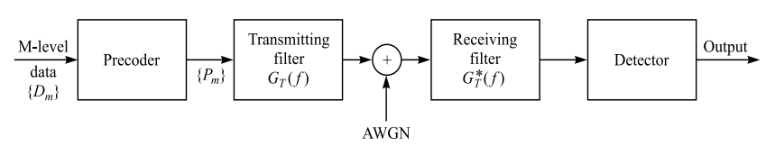
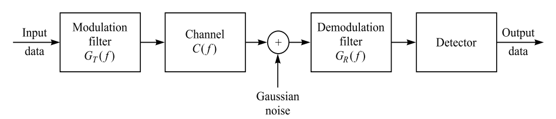

# Transimission Model for Narrow-band Signal and Channel

Keywords: transmission, complex baseband, band-limited, pulse shaping, matched filter, optimum receiver filter

## Baseband (Lowpass) Transmitted Signal

For different types of digital modulation techniques, a common form is given as (Proakis 2008, C9.2)

$$v(t)=\sum_{n=-\infty}^{\infty}I_ng(t-nT),$$

where $1/T$ is the sampling frequency, ${I_n}$ is the discrete complex modulated symbols, no matter BPSK, QPSK, QAM, 16QAM and on. $g(t)$ is a pulse function which 

- maps the complex symbols into continuous signal (a signal can not be time-limited and frequency-limited at the same time due to Fourier Transform),
- shapes the signal into narrow-signal, $G(f)=0$ for $|f|>W$.

## Band-limited Channel

To increase the efficiency, the use of a portion of the channel is expected to not interfere other portions, which makes the target designed goal is to have a band-limited channel.

An ideal (or nondistorting) band-limited channel is defined as if the amplitude response $|C(f)|$ is constant for $|f|\leq W$, and $C(f)=0$ for $|f|>W$, and the envelope delay $\tau(f)$ is a linear function of frequency. $|C(f)|$ is the frequency response of the time-domain channel $c(t)$.

## Baseband Received Signal

After $v(t)$ goes through the channel $c(t)$, the received signal is the convolution of $v(t)$ and $c(t)$

$$\begin{aligned}
r(t)=&\int_{-\infty}^{\infty}\sum_{n=-\infty}^{\infty}I_ng(\tau-nT)c(t-\tau)d\tau+z(t)\\
\overset{\tau'=\tau-nT}{=}&\sum_{n=-\infty}^{\infty}I_n\int_{-\infty}^{\infty}g(\tau')c(t-\tau'-nT)d\tau'+z(t)\\
=&\sum_{n=-\infty}^{\infty}I_nh(t-nT)+z(t)
\end{aligned},$$

where $h(t)=\int_{-\infty}^{\infty}g(\tau)c(t-\tau)d\tau$ is the effective channel response combining pulse shaping function and pure channel response, and $z(t)$ represents the additive white Gaussian noise (AWGN).

## Filtering Optimally the Received Signal

The **optimum** filter (derived from the correlation receiver based on MAP decision rule) at the recevier $f(t)$ for AWGN channel from the point of view of signal detection is **mathched filed**, which matches to the received pulse $f(t)=h(T-t)$, followed by a sampler operating at the symbol rate $1/T$. The frequency response is $F(f)=H^*(f)e^{-j2\pi fT}$, the complex conjugate $H^*(f)$ and the phase shift $e^{-j2\pi fT}$ due to sampling delay (Proakis 2008, C4.2).

### Matched Filter Is Optimum

From Karhunen-Loeve expansion, the received signal can be expanded in the series

$$r(t)=\lim_{N\rightarrow\infty}\sum_{k=1}^{N}r_k\phi_k{t},$$

where $\{\phi_k(t)\}$ is a complete set of orthonormal functions and $\{r_k\}$ are the observalbe random variables obtained by projecting $r(t)$ onto the set $\{\phi_k(t)\}$. This is important, since it maps the continuous received signal $r(t)$ back to digital symbols $\{r_k\}$ as

$$r_k=\sum_{n=-\infty}^{\infty}I_nh_{kn}+z_k,\quad k=1,2,\cdots$$

where $h_{kn}$ is the value obtained from projecting $h(t-nT)$ onto $\phi_k(t)$, and $z_k$ is to project $z(t)$ onto $\phi_k(t)$. The sequence $\{z_k\}$ is Gaussian with zero-mean and covariance $\mathbb{E}[z_k^*z_m]=2N_0\delta_{km}$. Note that for finite sequence, it is normal that the received sequence is longer than the transmitted sequence.

The joint probability density function (PDF) of $\mathbf{r}_N=[r_1,r_2,\cdots,r_N]$ conditioned on the transmitted sequence $\mathbf{I}_P= [I_1,I_2,\cdots,I_P]$ is

$$p(\mathbf{r}_N|\mathbf{I}_P)=\left(\frac{1}{2\pi N_0}\right)^N\exp\left(-\frac{1}{2N_0}\sum_{k=1}^{N}\left|r_k-\sum_{n}I_nh_{kn}\right|^2\right),.$$

The optimum recevied filter, which should be related to $h(t)$, should optimize the above joint PDF. Taking the logrithm of the PDF and ignore the constant, we have

$$\begin{aligned}
    \log p(\mathbf{r}_N|\mathbf{I}_P)=&-\sum_{k=1}^{N}\left|r_k-\sum_{n}I_nh_{kn}\right|^2\\
    =&-\sum_{k=1}^{N}(r_k-\sum_{n}I_nh_{kn})(r_k-\sum_{n}I_nh_{kn})^*\\
    =&-\sum_{k=1}^{N}\left(r_kr_k^*-r_k\sum_{n}I_n^*h_{kn}^*-r_k^*\sum_{n}I_nh_{kn}+\sum_{n}I_nh_{kn}\sum_{m}I_m^*h_{km}^*\right)\\
    =&-\sum_{k=1}^{N}|r_k|^2-\sum_{n}\sum_{m}\left(I_nI_m^*\sum_{k=1}^{N}h_{kn}h_{km}^*\right)+2\mathcal{Re}\left(\sum_{n}I_n\left(\sum_{k=1}^{N}r_kh_{kn}^*\right)\right).
\end{aligned}$$

The optimation is related to $\{r_k\}$. For the first term, the power of $r_k$ is often assumed to be fixed to some value, such as unity. Therefore, To maximize the log of PDF is to maximize the third term, we just need to maximize the term $\sum_{k=1}^{N}r_kh_{kn}^*$, which is called *sufficient statistics* in this optimization problem. Therefore, with

$$y_n=y(nT)=\int_{-\infty}^{\infty}r(t)h^*(t-nT)dt,$$

we have sufficient information to do the decision. Therefore, the optimum filter at time instant $t=nT$ is $f(t)=h(-t+nT)$.

With the optimum filter at the receiver at time instant $t=nT$, the transmission mode can be rewritten to

$$\begin{aligned}
y(t=kT)=&y_k=\int_{-\infty}^{\infty}r(\tau)f^*(kT-\tau)d\tau\\
=&\sum_{n=-\infty}^{\infty}I_n\int_{-\infty}^{\infty}[h(\tau-nT)+z(\tau)]h^*(\tau-kT)d\tau\\
\overset{\tau'=\tau-kT}{=}&\sum_{n=-\infty}^{\infty}I_nx_{k-n}+n_k,\\
\end{aligned}$$

where $x_n=x(t=nT)=\int_{-\infty}^{\infty}h^*(\tau)h(\tau+nT)d\tau$ is the filtered output of received response at the receiver, sampling at the rate of $1/T$. $n_n=n(t=nT)=\int_{-\infty}^{\infty}z(\tau)h^*(\tau-nT)d\tau$ is the filtered noise. Note that $x(t)$ represents also the autocorrelation function of $h(t)$.

This is the most-used channel model in narrow-band channel. The complex signal symbols are carried by the effective pulse $x(t)$ and its shifted version. This effective pulse includes effect of pulse shaping function at the transmitter, channel response, as well as optimum receiver filter.

### Discrete-Time Signal with Sampling Rate $1/T$

Hence, assume that the output is sampled at $t=kT$, we can obtain the discrete-time signal

$$y_k=\sum_{n=-\infty}^{\infty}I_nx_{k-n}+n_k.$$

Note that the index $k$ is for the observation. The amount of the observation samples could be different from the length of the transmitted symbol sequence. The above equation can be rewritten to clearly illustrate ISI effect

$$y_k=x_0I_k+\sum_{n=-\infty,n\neq k}^{\infty}I_nx_{k-n}+n_k,$$

where the second term is the ISI component.

Normally we assume that the ISI affects a finite number of symbols, i.e. $x_n=0$ for $|n|>L$. $x_n$ is often named as ***equivalent discrete-time transversal filter***. With $2L$ non-zero coefficients, this filter spans a time interval of $2LT$ seconds.

### Ideal Channel and Distorted Channel

Consider **ideal channel**, i.e. $C(f)=1$ when $|f|\leq W$, for designing band-limited signals fro no ISI, $x_k$ should follow *Nyquist Theorem*. The block diagram of the signal model would be

For channels with distortion, 

From above, we have derived that the optimum demodulation filter is matched filter. Here, we talk about a little bit about the suboptimum doemodulator.

At the output of the demodulator, we have 

$$G_T(f)C(f)G_R(f)=X_de^{-j2\pi ft_0},\quad |f|\leq W,$$

where $X_d(f)$ is the desired frequency response of the cascade of the modulator, channel, and demodulator. If we design $X_d(f)$ to a raised cosine filter $X_{rc}(f)$, according to Nyquist nonISI theorem, we will have zero ISI at the output. Assume that $C(f)$ is known, we can have two possible solutions

#### Precompensate for the total channel distortion at the transmitter, recevier filter matched to the recevied signal

$$\begin{aligned}
    |G_T(f)|=&\frac{\sqrt{X_{rc}(f)}}{|C(f)|},\quad |f|\leq W\\
    |G_R(f)|=&\sqrt{X_{rc}(f)},\quad |f|\leq W.
\end{aligned}$$

#### Compensate the channel both at the transmitter and receiver filter

$$\begin{aligned}
    |G_T(f)|=&\frac{\sqrt{X_{rc}(f)}}{|C(f)|^{1/2}},\quad |f|\leq W\\
    |G_R(f)|=&\frac{\sqrt{X_{rc}(f)}}{|C(f)|^{1/2}},\quad |f|\leq W.
\end{aligned}$$

These two solutions lead to different average transmitted power, resulting in different SNR.

## Further Filtering: Whitened Matched Filter

It is interesting to discuss the distribution of the noise. $z(t)$ can be modeled as AWGN, i.e. $z(t)\sim\mathcal{N}(0,2N_0)$. Assume that the equivalent discrete-time transversal filter spans a time interval of $2LT$ seconds. Assume wide-sense stationary (WSS) channel, for different time index, $t_1$ and $t_2$ are independent, which gives 

$$\mathbb{E}[z^*(t_1)z(t_2)]=\begin{cases}
    2N_0,&t_1=t_2\\
    0,&t_1\neq t_2,
\end{cases}$$

which is also called **white noise**. However, after the matched filter $f(t)$, we have

$$\begin{aligned}
    \mathbb{E}[n^*_{k_1}n_{k_2}]=&\mathbb{E}\left[\int_{-\infty}^{\infty}z^*(\tau)h^*(\tau-k_1T)d\tau\int_{-\infty}^{\infty}z(t)h(t-k_2T)dt\right]\\
    =&\int_{-\infty}^{\infty}\int_{-\infty}^{\infty}\mathbb{E}\left[z^*(\tau)z(t)\right]h^*(\tau-k_1T)h(t-k_2T)d\tau dt\\
    =&2N_0\int_{-\infty}^{\infty}h^*(\tau-k_1T)h(\tau-k_2T)d\tau\\
    =&2N_0x_{k_1-k_2}
\end{aligned}$$

for $|k_1-k_2|\leq L$. Otherwise, it is 0.

We can see that the noise is correlated in general， except when $x_k=0,k\neq0$. For furhter performance evaluation, such as calculating the error rate, it is desirable to whiten the noise sequence by further filtering the sequence $\{y_k\}$.

Now we denote the two-sided $z$ transform $X(z)$ of the sampled autocorrelation function $x_k$ as

$$X(z)=\sum_{k=-L}^{L}x_kz^{-k}.$$

For the autocorrelation, we have $x_k=x_{-k}^*$, resulting in $X(z)=X^*(\frac{1}{z^*})$, and the $2L$ roots of $X(z)$ have the symmetry that if $\rho$ is a root, so is $1/\rho^*$. Due to this fact, the $X(z)$ can be factored as

$$X(z)=A(z)A^*\left(\frac{1}{z^*}\right),$$

where $A(z)$ is a polynomial of degree $L$ having the roots $\rho_1,\rho_2,\cdots,\rho_L$ and $A^*(1/z^*)$ having roots $1/\rho_1,1/\rho_2,\cdots,1/\rho_L$.

Therefore, if we have a filter

$$J(z)=\frac{1}{A^*\left(\frac{1}{z^*}\right)},$$

the roots $\rho$ and correspondingly $1/\rho$ become poles.

---

References

- Proakis J. G., and Salehi M., (2008). Digital Communications, 5th Edition. McGraw-Hill.
