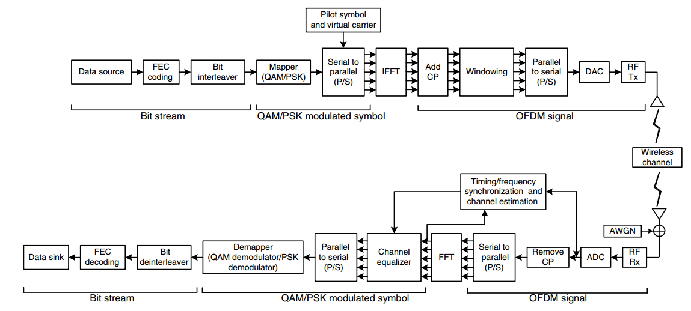

# Survey of Orthogonal Frequency Devision Multiplex (OFDM)

## 1. Overview of Single-Carrier Transmission

The transmit symbols are **pulse-shaped** by a filter at the transmitter. Then receiveing them through a **band-limited** channel with the **receiver filter**, **eqalized** and **detector**. The equalizer is designed to compensate the effect of channel. Since the channel bandwidth is finite, the pulse-shaping filter cannot be time-limited, which may introduce inter-symbol interference (ISI).

Assume that the channel effect is completely compensated by the equalizer. The **ISI-free** transmission is guaranteed by the **Nyquist criterion**. The Nyquist filter is an ideal low pass filter (LPF), which is a sinc function in time-domain. But the ideal Nyquist filter is not physically realizable. Instead, we can use the **raised-cosine filter** at the transmitter, whose bandwidth is wider than that of Nyquist filter. If the channel is ideal, the transmit filter and receiver filter can be **square-root raised cosine filters**, which are a raised cosine filter when they are combined.

With the symbol rate becoming larger, the signal bandwidth becomes larger. If the signal bandwidth becomes larger than the coherence bandwidth, the link suffers the **multi-path effect**, another type of ISI. In general, adaptive equaliers implemented by finite impulse response (FIR) filters with cap coefficients are employed to deal with the ISI incurred by multi-paths.

In the time domain, the **optimum** equalizer for the multi-path fading channel is **maximum-likelihood sequence detector (MLSD)**. One type of suboptimum equalizers is the **linear** transversal filter (such as **zero-forcing**, **least-square**, **minimum mean square error**). The **decision-feedback equalizer** explots the **nonlinearity** by adding a feedback module to improve performance of the linear equalization.

## 2. History of OFDM

**<to do>**

## 3. Summary of OFDM

### Freqeuncy Domain Considerations

Not all the subcarrierers of carry useful data.

</img>

At the two side of the bandwidth, there are guard subcarriers with no/small energy, which are not used. For example in LTE for bandwidth 10 MHz, the FFT size is 1024 with subcarrier spacing 15 kHz. The total bandwith is $1024*15=15305$ Hz, which is about 5 MHz more than 10 MHz. Provding such large null subcarriers is to allow for easily-realizable **anti-aliaing** filters. The null subcarrier at the center is to allow the use of simple direct-conversion (zero-IF) RF receivers which lead to strong interference at DC, and avoid the DC offsets caused by ADCs and DACs.

### OFDM System Block Diagram

</img>

Figure: OFDM System Block Diagram (2010 Cho).

## Pulse Shaping and Windowing

### Two famous pulse-shaping fulters (time-domain window)

- Raised-Cosine Filter

- Gaussian Filter

### References

- Cho, Y. S., Kim, J., Yang, W. Y., &amp; Kang, C. G. (2010). MIMO-OFDM wireless communications with MATLAB. Singapore, Singapore: John Wiley &amp; Sons (Asia) Pte.
