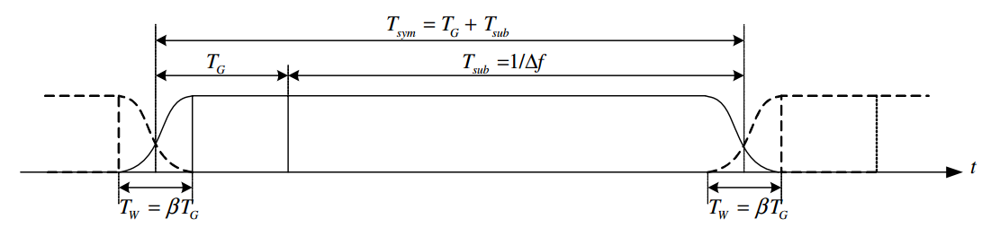

# Survey of Orthogonal Frequency Devision Multiplex (OFDM)

# Notation

Notation | Meaning
---------|---------
$T_s$ | duration of a symbol
$T_{OFDM}$ | duration of a OFDM symbol
$T_{sub}$ | duration of a OFDM symbol without guard interval
$T_{g}$ | duration of guard interval (e.g. CP)
$N_{sub}$ | number of subcarriers without guard interval

# Overview of Single-Carrier Transmission

The transmitted symbols are **pulse-shaped** by a filter at the transmitter. Then receiveing them through a **band-limited** channel with the **receiver filter**, **eqalized** and **detector**. The equalizer is designed to compensate the effect of channel. Since the channel bandwidth is finite, the pulse-shaping filter cannot be time-limited, which may introduce inter-symbol interference (ISI).

Assume that the channel effect is completely compensated by the equalizer. The **ISI-free** transmission is guaranteed by the **Nyquist criterion**. The Nyquist filter is an ideal low pass filter (LPF), which is a sinc function in time-domain. But the ideal Nyquist filter is not physically realizable. Instead, we can use the **raised-cosine filter** at the transmitter, whose bandwidth is wider than that of Nyquist filter. If the channel is ideal, the transmit filter and receiver filter can be **square-root raised cosine filters**, which are a raised cosine filter when they are combined.

With the symbol rate becoming larger, the signal bandwidth becomes larger. If the signal bandwidth becomes larger than the coherence bandwidth, the link suffers the **multi-path effect**, another type of ISI. In general, adaptive equaliers implemented by finite impulse response (FIR) filters with cap coefficients are employed to deal with the ISI incurred by multi-paths.

The equalizer in single-carrier transmission is usually done in the time domain. The **optimum** equalizer for the multi-path fading channel is **maximum-likelihood sequence detector (MLSD)**. One type of **suboptimum** equalizers is the **linear** transversal filter (such as **zero-forcing**, **least-square**, **minimum mean square error**). The **decision-feedback equalizer** exploits the **nonlinearity** by adding a feedback module to improve performance of the linear equalization.

# History of OFDM

**<to do>**

# Summary of OFDM

## Freqeuncy Domain Considerations

Not all the subcarrierers of carry useful data.

</img>

### Guard Band

To reduce out-of-band power, and avoid attenuation by low pass filter in ADC or DAC at the frequency close to Nyquist freqeuncy $f_s/2$ (Prasad 2004, P121), at the two side of the bandwidth, there are **guard subcarriers (guard band)** with no energy, which are not used. For example in LTE for bandwidth 10 MHz, the FFT size is 1024 with subcarrier spacing 15 kHz. The total bandwith is $1024*15=15305$ Hz, which is about 5 MHz more than 10 MHz. Provding such large null subcarriers is to allow for easily-realizable **anti-aliaing** filters. 

### Null DC Subcarrier

The null subcarrier at the center is to allow the use of simple direct-conversion (zero-IF) RF receivers which lead to strong interference at DC, and avoid the DC offsets caused by ADCs and DACs.

### Power Spectrum Density (PSD) of OFDM

The PSD of an OFDM depends on 4 components; the IDFT modulation, the CP/ZP time guard interval, the pulse shaping (of the OFDM symbol, or called windowing), and the interpolation filtering. The PSD of the analog baseband signal $x(t)$ is defined as 

$$P_x(f)=\lim_{T\rightarrow\infty}\left(\frac{1}{T}\mathbb{E}\left[\left|\mathcal{F}\{x_t(t)\}\right|^2\right]\right).$$

# OFDM System 

</img>

Figure: OFDM System Block Diagram (2010 Cho).

## OFDM Modulation (IDFT) and Demodulation (DFT)

If there are $N_{sub}$ subcarriers, OFDM transmitter can map $N_{sub}$ parallel PSK or QAM symbols from S/P conversion into each subcarrier. Let $X_l[k]$ denote the $l$-th transmit OFDM symbol at the $k$-th subcarrier, $l=0,1,2,\cdots,\infty$, and $k=0,1,2,\cdots,N_{sub}-1$. The discrete-time baseband OFDM signal sampled at $t=lT_{OFDM}+nT_s$ is

$$x_l[n]=\frac{1}{N_{sub}}\sum_{k=0}^{N_{sub}-1}X_l[k]e^{j2\pi kn/N_{sub}},\quad n=0,1,\cdots,N_{sub}-1.$$

At the receiver, the transmitted OFDM symbol $X_[k]$ can be reconstructed by the orthogonality among the subcarrieres as

$$\begin{aligned}
    Y_[k]&=\sum_{n=0}^{N-1}y_l[n]e^{-j2\pi kn/N}\\
    &=\sum_{n=0}^{N-1}\left\{\sum_{m=0}^{\infty}h_l[m]x_l[n-m]+z_l[m]\right\}e^{-j2\pi kn/N}\\
    &=\sum_{n=0}^{N-1}\left\{\sum_{m=0}^{\infty}h_l[m]x_l[n-m]\right\}e^{-j2\pi kn/N}+\sum_{m=0}^{\infty}\sum_{n=0}^{N-1}z_l[m]\\
\end{aligned}$$

## Guard Interval

### Cyclic Prefix (CP) - Remove ISI of OFDM Symbols

In this module, the last $N_{CP}$ samples of the $N_{IFFT}$ points are copied at the front of the symbol, creating a composite symbol that is $N_{CP}+N_{IFFT}$ samples long. Doing this has the effect of making the composite symbol appear continuous in time, that is, the $N_{IFFT}$-point FFT of the smbol will be identical regardless of which $N_{IFFT}$ samples we choose out of the $N_{CP}+N_{IFFT}$ available samples, preventing multipath fading.

With CP, the convolution in the time domain is equivalent to the multiplication of DFT in the frequency domain for each subcarrier. Note that $Y_l[k]\neq H_l[k]X_l[k]$ without CP, since $\mathrm{DFT}\{y_l[n]\}\neq\mathrm{DFT}\{x_l[n]\}$.

The length of CP should be not less than the equivalent channel length (number of channel taps) to remove the ISI for OFDM symbols.

### Cyclic Suffix (CS)

Cyclic suffix is the copy of the head part of an OFDM symbol, which is inserted at the end of the symbol.

### Zero Padding (ZP)

Zero may be inserted in the guard interval. Since a CP is usually applied, the guard interval is usually appened.

## Windowing - Smooth the Transition Between OFDM Symbols

Originally, no pulse-shaping filter for each symbol at a subcarrier in OFDM. This can be seen as adding a rectangle window in the time domain (sinc in the frequency domain) for each symbol, resulting in large **out-of-band power** of an OFDM symobl (hard switching between OFDM symbols). On the other hand, consecutive OFDM symbols rarely begin with the same amplitude and phase that the prior symbol ended with. Another source of out-of-band power is the nonlinearity of the transmitter amplifier (Pauli, 1998). 

To reduce this **out-of-band power** in terms of symbol discontinuity, a time-domain shaping function like raised cosine (RC) windowing is used to shape the OFDM symbol (Cho 2010, §4.2.3 P133). With guard interval at the end of a symbol, no matter CS or ZP, a RC window is applied to this guard interval, rolling off from 1 to 0 over its duration. Another raised cosine window is applied to the CP of the next OFDM symbol rolling on from 0 to 1. These two RC windows give the desired smooth transition from one symbol to the next in the time domain, while reducing the out-of-band power in the freqeuncy domain. Since the window part is also discarded by the receiver, the orthogonality of the subcarriers of the OFDM signal is restored by the rectangular receiver filter implemented by the DFT, requiring the **correct estimation** of the starting time of the OFDM symbol.

The baseband signals for the $l$-th OFDM symbol, shaped by an RC window with a roll-off factor $\beta$ can be expressed as

$$x_l(t)=h_{RC}(t-lT_{OFDM})\sum_{k=0}^{N-1}X_{l,k}\Psi_{l,k}(t),$$

where the spectral shaping filter (which is in time domain) is

$$h_{RC}(t)=\begin{cases}
    0.5+0.5\cos\left(\pi(t+\beta T_{OFDM}+T_g)/\beta T_{OFDM}\right),&-(T_g+\beta T_{OFDM}/2)\leq t<-(T_g-\beta T_{OFDM}/2)\\
    1.0,&-(T_g+\beta T_{OFDM}/2)\leq t<(T_{sub}-\beta T_{OFDM}/2)\\
    0.5+0.5\cos\left(\pi(t-T_{sub}+\beta T_{OFDM})/\beta T_{OFDM}\right),&(T_{sub}-\beta T_{OFDM}/2)\leq t<(T_{sub}+\beta T_{OFDM}/2)
\end{cases}$$

and

$$\Psi_{l,k}(t)=\begin{cases}
    e^{j2\pi f_k(t-lT_{OFDM})},&-(T_g+T_w/2)\leq t\leq(T_{sub}+T_w/2)\\
    0,&\mathrm{otherwise}.
\end{cases}$$

</img>

Figure: Structure of an OFDM signal with windowing (extended guard interval).

> This RC function is similar but not equal to RC filter used as impulse shaper in single carrier transmission systems. The differences are:
> 1. the RC function for OFDM is in time domain, while for single carrier system in frequency domain,
> 2. the "flat top" is usually much longer for OFDM systems, while for single carrier system the relation between "flat top" and edges are fixed by the roll-off factor.

The factor of windowing is the **length of window**. The effect of windowing is that it imporoves spectral regrowth, but at the expense of multipath fading immunity, since redundancy int he guard band is reduced due to the smoothing effect.

> 10% Guard band is needed in order to meet out-of-band leakage rejection requirement.

Generally speaking, if we consider IFFT modulation, time guard interval, windowing, a discrete-time baseband signal $x[n]$ for all OFDM symbol is

$$x[n]=\sum_{l=-\infty}^{\infty}x_l[n]=\sum_{l=-\infty}^{\infty}\left(h_{RC}[n-lT_{OFDM}]\sum_{k=0}^{N-1}X_{l,k}\Psi_{l,k}[n]\right)$$

# OFDM Variation

## Coded OFDM (COFDM)

## Cyclic-Prefix OFDM (CP-OFDM) [LTE & 5G Standard]

CP-OFDM is the traditional OFDM with cylic prefix.

## Zero-Padding OFDM (ZP-OFDM)

## Filtered OFDM (F-OFDM)

Based on the CP-OFDM, a subband filter is added at each subcarrier. F-OFDM is used to solve the issues of existing for OFDM waveform, which are listed as

- OFDM waveform is not spectrum localized, since 10% guard band is need to meet out-of-band leakage rejection requirement,
- OFDM waveform is not flexible in terms of subcarrier spacing and CP,
- OFDM waveform cannot support asynchronous operation, which means timming adjustment is needed.

# Fast Programing for DFT

The $N$-point DFT is

$$X[k]=\sum_{n=0}^{N-1}x[n]W_N^{nk},\quad k=0,1,\cdots,N-1,$$

where $W_N=e^{-j2\pi/N}$. Each of $N$ subcarriers has $N$ multiplications and a summation, resulting in the $\mathcal{O}(N^2)$ arithmetic complexity.

## Fast Fourier Transform (FFT)

For the normal DFT, the complexity is $\mathcal{O}(N^2)$. The Cooley-Tukey FFT algorithm reduces the complexity to $\mathcal{O}(N\log N)$.

## Winograd Fourier Transform (WFT)

Relative to FFT, the WFT algorithm significantly reduces the number of multiplication operations, and does not increase the number of addition operations in many cases (Silverman, 1977).

# References

- Cho, Y. S., Kim, J., Yang, W. Y., &amp; Kang, C. G. (2010). MIMO-OFDM wireless communications with MATLAB. Singapore, Singapore: John Wiley &amp; Sons (Asia) Pte.
- Pauli, M., &amp; Kuchenbecker, P. (n.d.). On the reduction of the out-of-band radiation of OFDM-signals. ICC '98. 1998 IEEE International Conference on Communications. Conference Record. Affiliated with SUPERCOMM'98 (Cat. No.98CH36220). doi:10.1109/icc.1998.683036
- Prasad, R. (2004). OFDM for wireless communications systems. Boston: Artech House.
